# 智融法助 v2.0 - 架构映射文档

> **文档目的**: 确保在调试和测试中能准确找到每个功能模块对应的代码文件
> **最后更新**: 2026-01-30

---

## 📋 功能模块总览

应用共包含 **10 个主功能模块** + **管理后台** + **辅助功能页面**，分为 4 大类：

### 🎯 咨询类 (3个模块)
- 智能咨询
- 风险评估
- 案件分析

### 📄 合同类 (3个模块)
- 合同生成 (包含合同规划场景)
- 合同审查
- 模板查询

### 🛠️ 工具类 (3个模块)
- 文档处理
- 文书起草
- 费用测算

### 🤖 智能引导 (1个模块)
- 智能引导 (首页Banner入口)

---

## 1️⃣ 智能咨询

### 基本信息
| 项目 | 值 |
|------|------|
| **路由** | `/consultation` |
| **分类** | 咨询类 |
| **功能描述** | 资深律师为您提供专业的法律咨询服务 |

### 前端文件
```
frontend/src/pages/LegalConsultationPage.tsx
frontend/src/pages/LegalConsultationPage.css
```

### 后端API
```
API路由文件:
├── backend/app/api/consultation_router.py
└── backend/app/api/v1/endpoints/smart_chat.py (expert-consultation)

服务文件:
├── backend/app/services/consultation_session_service.py
├── backend/app/services/consultation_history_service.py
└── backend/app/services/deepseek_service.py

主要端点:
├── POST /api/consultation/upload                      - 上传咨询文件
├── POST /api/consultation                             - 发起咨询
├── POST /api/v1/smart-chat/expert-consultation         - 专家咨询
└── POST /api/v1/consultation-history/sessions          - 会话管理
```

### 数据模型
```
backend/app/models/consultation_history.py
```

---

## 2️⃣ 风险评估

### 基本信息
| 项目 | 值 |
|------|------|
| **路由** | `/risk-analysis` |
| **分类** | 咨询类 |
| **功能描述** | 深度分析法律文件，识别潜在风险点 |

### 前端文件
```
frontend/src/pages/RiskAnalysisPageV2.tsx              (当前版本)
frontend/src/pages/RiskAnalysisMultiTaskTestPage.tsx  (多任务测试页面)
frontend/src/pages/RiskAnalysisPage.tsx                  (旧版本)
```

### 后端API
```
API路由文件:
└── backend/app/api/v1/endpoints/risk_analysis.py

服务文件:
├── backend/app/services/risk_analysis_service.py
├── backend/app/services/risk_analysis_report_generator.py
└── backend/app/services/entity_risk_service.py

主要端点:
├── POST /api/v1/risk-analysis/submit                          - 提交分析
├── POST /api/v1/risk-analysis/upload                          - 上传文档
├── POST /api/v1/risk-analysis/start/{session_id}                - 开始分析
├── GET  /api/v1/risk-analysis/result/{session_id}               - 获取结果
├── GET  /api/v1/risk-analysis/report/{session_id}/download      - 下载报告
└── WS   /api/v1/risk-analysis/ws/{session_id}                 - WebSocket进度
```

### 数据模型
```
backend/app/models/risk_analysis.py
backend/app/models/risk_analysis_preorganization.py
```

---

## 3️⃣ 案件分析

### 基本信息
| 项目 | 值 |
|------|------|
| **路由** | `/litigation-analysis` |
| **分类** | 咨询类 |
| **功能描述** | 分析案件材料，制定诉讼策略 |

### 前端文件
```
frontend/src/pages/LitigationAnalysisPage.tsx
```

### 后端API
```
API路由文件:
└── backend/app/api/v1/endpoints/litigation_analysis.py

服务文件:
├── backend/app/services/litigation_analysis_report_generator.py
└── backend/app/services/litigation_preorganization_report_generator.py

主要端点:
├── POST /api/v1/litigation-analysis/start                        - 开始分析
├── GET  /api/v1/litigation-analysis/result/{session_id}          - 获取结果
├── GET  /api/v1/litigation-analysis/report/{session_id}/download   - 下载报告
└── WS   /api/v1/litigation-analysis/ws/{session_id}             - WebSocket进度
```

### 数据模型
```
backend/app/models/litigation_analysis.py
```

---

## 4️⃣ 合同生成

### 基本信息
| 项目 | 值 |
|------|------|
| **路由** | `/contract/generate` |
| **分类** | 合同类 |
| **功能描述** | 基于需求智能生成各类合同文书 |
| **合同规划** | 包含合同规划场景模式 |

### 前端文件
```
frontend/src/pages/ContractGenerationPage.tsx       # 主页面
frontend/src/pages/ContractPlanningPage.tsx         # 会话恢复页面
frontend/src/components/PlanningResultDisplay.tsx # 规划结果展示组件
frontend/src/components/PlanningModeSelector.tsx  # 规划模式选择组件
```

### 后端API
```
API路由文件:
├── backend/app/api/contract_generation_router.py
└── backend/app/api/v1/endpoints/contract_templates.py

服务文件:
└── backend/app/services/contract_generation/
    ├── workflow.py
    ├── agents/
    ├── rag/
    ├── structural/
    └── tools/

主要端点:
├── POST /api/contract-generation/analyze           - 分析需求
├── POST /api/contract-generation/generate          - 生成合同
├── POST /api/contract-generation/process-document    - 处理文档
├── POST /api/contract-generation/planning          - 合同规划
└── POST /api/v1/contract                            - 模板管理
```

### 数据模型
```
backend/app/models/contract_template.py
```

### 合同规划模式说明
```typescript
// 当用户需求为"合同规划"场景时，在合同生成页面内显示以下模式：

planning_mode:
  - 'multi_model'  # 多模型融合模式：使用多个模型协同生成复杂合同
  - 'single_model' # 单模型生成模式：使用单个模型生成简单合同

planning_result: {
  contracts: [],          # 生成的合同列表
  signing_order: [],       # 签署顺序
  relationships: [],      # 合同间关系
  risk_notes: [],         # 风险提示
  overall_description: ''  # 总体描述
}
```

---

## 5️⃣ 合同审查

### 基本信息
| 项目 | 值 |
|------|------|
| **路由** | `/contract/review` |
| **分类** | 合同类 |
| **功能描述** | 专业审查合同条款，识别潜在风险 |
| **OnlyOffice** | 集成在线文档编辑器 |

### 前端文件
```
frontend/src/pages/ContractReview.tsx             (主页面)
frontend/src/pages/ContractReviewHistory.tsx        (历史记录)
```

### 后端API
```
API路由文件:
└── backend/app/api/contract_router.py

服务文件:
├── backend/app/services/contract_review_service.py
├── backend/app/services/langgraph_review_service.py
├── backend/app/services/contract_review/
│   ├── __init__.py
│   ├── graph.py                        # LangGraph 流程图
│   ├── state.py                        # 审查状态
│   ├── rule_assembler.py                # 规则组装器
│   ├── nodes/                         # 审查节点
│   │   ├── basic.py
│   │   └── ai_reviewer.py
│   ├── schemas.py                     # 数据模型
│   ├── utils.py                       # 工具函数
│   └── health_assessment.py            # 健康度评估
└── backend/app/services/review_rules_service.py

主要端点:
├── POST /api/contract/upload                           - 上传合同
├── POST /api/contract/{contract_id}/deep-review         - 开始深度审查
├── POST /api/contract/{contract_id}/apply-revisions      - 应用修订
├── GET  /api/contract/{contract_id}/onlyoffice-config  - 获取 OnlyOffice 配置
├── GET  /api/contract/{contract_id}/revision-config     - 获取修订配置
├── GET  /api/contract/{contract_id}/review-results      - 获取审查结果
└── POST /api/contract/{contract_id}/callback            - OnlyOffice 回调
```

### 数据模型
```
backend/app/models/contract.py
backend/app/models/contract_review_task.py
backend/app/models/contract_knowledge.py
```

---

## 7️⃣ 模板查询

### 基本信息
| 项目 | 值 |
|------|------|
| **路由** | `/contract` |
| **分类** | 合同类 |
| **功能描述** | 查找合适的法律文书模板 |

### 前端文件
```
frontend/src/pages/ContractPage.tsx
```

### 后端API
```
API路由文件:
└── backend/app/api/v1/endpoints/contract_templates.py

服务文件:
├── backend/app/services/template_feature_extractor.py
├── backend/app/services/legal_knowledge_base.py
└── backend/app/services/document_templates.py

主要端点:
├── GET  /api/v1/contract/                       - 获取模板列表
├── GET  /api/v1/contract/{template_id}/content  - 获取模板内容
├── POST /api/v1/contract/upload                 - 上传模板
└── GET  /api/v1/contract/knowledge-graph       - 合同知识图谱
```

### 数据模型
```
backend/app/models/contract_template.py
backend/app/models/contract_knowledge.py
backend/app/models/category.py
```

---

## 8️⃣ 文档处理

### 基本信息
| 项目 | 值 |
|------|------|
| **路由** | `/document-processing` |
| **分类** | 工具类 |
| **功能描述** | 文档预处理、智能编辑、文件比对 |
| **OnlyOffice** | 集成在线文档预览 |

### 前端文件
```
frontend/src/pages/DocumentProcessingPage.tsx
```

### 后端API
```
API路由文件:
├── backend/app/api/document_router.py
└── backend/app/api/v1/endpoints/system.py

服务文件:
├── backend/app/services/document_preprocessor.py
├── backend/app/services/document_renderer.py
├── backend/app/services/docx_editor.py
├── backend/app/services/document_structurer.py
├── backend/app/services/pdf_service.py
├── backend/app/services/markdown_renderer.py
├── backend/app/services/converter.py
└── backend/app/services/unified_document_service.py

主要端点:
├── POST /api/document/generate-from-content       - 从AI内容生成
├── POST /api/document/process-file-to-standard    - 标准化文件
├── POST /api/v1/system/health                 - 系统健康检查
└── POST /api/v1/system/onlyoffice-diagnostic    - OnlyOffice 诊断
```

---

## 9️⃣ 文书起草

### 基本信息
| 项目 | 值 |
|------|------|
| **路由** | `/document-drafting` |
| **分类** | 工具类 |
| **功能描述** | 起草各类司法文书和函件 |

### 前端文件
```
frontend/src/pages/DocumentDraftingPage.tsx
```

### 后端API
```
API路由文件:
└── backend/app/api/v1/endpoints/document_drafting.py

服务文件:
└── backend/app/services/document_drafting/workflow.py

主要端点:
├── GET  /api/v1/document-drafting/templates   - 获取文书模板
├── POST /api/v1/document-drafting/analyze     - 分析需求
└── POST /api/v1/document-drafting/generate    - 生成文书
```

---

## 🔟 费用测算

### 基本信息
| 项目 | 值 |
|------|------|
| **路由** | `/cost-calculation` |
| **分类** | 工具类 |
| **功能描述** | 计算诉讼费用、律师费等 |

### 前端文件
```
frontend/src/pages/CostCalculationPage.tsx
```

### 后端API
```
API路由文件:
└── backend/app/api/cost_calculation_router.py

服务文件:
└── backend/app/services/unified_document_service.py

主要端点:
├── POST /api/cost-calculation/upload      - 上传案件文档
├── POST /api/cost-calculation/extract     - 提取案件信息
└── POST /api/cost-calculation/calculate-v2 - 计算费用
```

---

## 🔟 智能引导

### 基本信息
| 项目 | 值 |
|------|------|
| **路由** | `/guidance` |
| **分类** | 智能引导 |
| **功能描述** | AI对话引导用户选择合适的功能模块 |
| **入口** | 首页Banner"开始智能引导"按钮 |

### 前端文件
```
frontend/src/pages/IntelligentGuidancePage.tsx
frontend/src/pages/IntelligentGuidancePage.css
frontend/src/components/ModuleNavBar/EnhancedModuleNavBar.tsx
```

### 后端API
```
API路由文件:
├── backend/app/api/v1/endpoints/smart_chat.py (guidance)
└── backend/app/api/v1/endpoints/search.py

服务文件:
└── backend/app/services/deepseek_service.py

主要端点:
├── POST /api/v1/smart-chat/guidance        - 智能引导对话
└── GET  /api/v1/search/global              - 全局搜索
```

### 引导流程 (4步骤)
```
1. 需求探索 - 了解用户的具体需求
2. 场景识别 - 确定适用的法律场景
3. 方案推荐 - 推荐最适合的解决方案
4. 行动引导 - 引导用户开始使用对应功能
```

---

## 1️⃣1️⃣ 场景选择

### 基本信息
| 项目 | 值 |
|------|------|
| **路由** | `/scene-selection` |
| **分类** | 辅助功能 |
| **功能描述** | 选择法律场景后跳转到对应功能模块 |

### 前端文件
```
frontend/src/pages/SceneSelectionPage.tsx
```

---

## 1️⃣2️⃣ 智能对话

### 基本信息
| 项目 | 值 |
|------|------|
| **路由** | `/smart-chat` |
| **分类** | 辅助功能 |
| **功能描述** | 通用智能对话界面 |

### 前端文件
```
frontend/src/pages/SmartChatPage.tsx
```

### 后端API
```
API路由文件:
└── backend/app/api/v1/endpoints/smart_chat.py

主要端点:
├── POST /api/v1/smart-chat/guidance            - 智能引导
├── POST /api/v1/smart-chat/expert-consultation - 专家咨询
└── POST /api/v1/smart-chat/general             - 通用对话
```

---

## 1️⃣3️⃣ 知识库管理

### 基本信息
| 项目 | 值 |
|------|------|
| **路由** | `/knowledge-base/*` |
| **分类** | 辅助功能 |
| **功能描述** | 知识库配置、测试、用户知识库管理 |

### 前端文件
```
frontend/src/pages/KnowledgeBaseConfigPage.tsx      # 知识库配置
frontend/src/pages/KnowledgeBaseTestPage.tsx        # 知识库测试
frontend/src/pages/UserKnowledgeBasePage.tsx        # 用户知识库
```

### 后端API
```
API路由文件:
├── backend/app/api/v1/endpoints/knowledge_base.py
└── backend/app/api/v1/endpoints/rag_management.py

服务文件:
└── backend/app/services/embedding_service.py

主要端点:
├── POST /api/v1/knowledge-base/create              - 创建知识库
├── GET  /api/v1/knowledge-base/list                - 获取知识库列表
├── POST /api/v1/knowledge-base/upload              - 上传文档
├── POST /api/v1/rag/query                          - RAG查询
└── DELETE /api/v1/knowledge-base/{kb_id}           - 删除知识库
```

### 数据模型
```
backend/app/models/knowledge_base.py
```

---

## 1️⃣4️⃣ 模板编辑

### 基本信息
| 项目 | 值 |
|------|------|
| **路由** | `/template/edit` |
| **分类** | 辅助功能 |
| **功能描述** | 编辑合同模板 |

### 前端文件
```
frontend/src/pages/TemplateEditPage.tsx
```

---

## 1️⃣5️⃣ 结果页面

### 基本信息
| 项目 | 值 |
|------|------|
| **路由** | `/result/:taskId` |
| **分类** | 辅助功能 |
| **功能描述** | |任务执行结果展示 |

### 前端文件
```
frontend/src/pages/ResultPage.tsx
```

### 后端API
```
API路由文件:
└── backend/app/api/v1/endpoints/tasks.py

主要端点:
├── GET  /api/v1/tasks/{task_id}             - 获取任务详情
├── POST /api/v1/tasks/{task_id}/pause       - 暂停任务
└── POST /api/v1/tasks/{task_id}/resume      - 恢复任务
```

### 数据模型
```
backend/app/models/task.py
backend/app/models/task_view.py
```

---

## 1️⃣6️⃣ 登录页面

### 基本信息
| 项目 | 值 |
|------|------|
| **路由** | `/login` |
| **分类** | 认证功能 |
| **功能描述** | 用户登录 |

### 前端文件
```
frontend/src/pages/LoginPage.tsx
```

### 后端API
```
API路由文件:
└── backend/app/api/v1/endpoints/auth.py

主要端点:
├── POST /api/v1/auth/login        - 用户登录
├── POST /api/v1/auth/register     - 用户注册
└── POST /api/v1/auth/refresh     - 刷新令牌
```

### 数据模型
```
backend/app/models/user.py
```

---

## 1️⃣7️⃣ 飞书集成

### 基本信息
| 项目 | 值 |
|------|------|
| **分类** | 外部集成 |
| **功能描述** | 飞书卡片交互、消息推送、回调处理、合同审查集成 |

### 功能模块
```
后端服务文件:
├── backend/app/api/v1/endpoints/feishu_callback.py    # 飞书回调 API
├── backend/app/utils/feishu_api.py                  # 飞书 API 工具类
├── backend/app/tasks/feishu_review_tasks.py         # 飞书审查任务
└── backend/app/services/knowledge_base/feishu_kb.py  # 飞书知识库集成

主要功能:
1. 飞书卡片交互 - 接收卡片点击事件
2. 飞书消息推送 - 发送文本消息和卡片消息
3. 飞书回调处理 - 处理飞书开放平台回调
4. 多维表操作 - 读取和更新飞书多维表
5. 合同审查集成 - 飞书文件触发合同审查任务
```

### 后端API
```
API路由文件端点:
└── backend/app/api/v1/endpoints/feishu_callback.py

主要端点:
├── POST /api/v1/feishu/card-action    - 飞书卡片交互
└── POST /api/v1/feishu/callback         - 飞书回调
```

### 飞书 API 工具 (feishu_api.py)
```
类名: FeishuApi

主要方法:
├── get_tenant_access_token()      # 获取 tenant_access_token (自动缓存)
├── get_base_table_data()         # 获取多维表数据
├── send_feishu_text_msg()       # 发送文本消息
├── send_feishu_card_msg()       # 发送卡片消息
├── update_base_table_data()      # 更新多维表数据
└── parse_feishu_card_callback()   # 解析飞书卡片回调数据

环境变量:
├── FEISHU_APP_ID                      # 飞书应用 ID
├── FEISHU_APP_SECRET                   # 飞书应用密钥
├── FEISHU_ENCRYPT_KEY                  # 加密密钥
├── FEISHU_VERIFICATION_TOKEN           # 验证令牌
├── FEISHU_BASE_API_URL              # 飞书 API 基础 URL
├── FEISHU_BITABLE_APP_TOKEN         # 多维表应用 Token
├── FEISHU_BITABLE_TABLE_ID           # 多维表 ID
└── FEISHU_TENANT_TOKEN_CACHE_KEY   # Token 缓存键
```

### 飞书审查任务 (feishu_review_tasks.py)
```
主要功能:
1. 接收飞书文件标识
2. 下载飞书文件到临时目录
3. 调用审查模块上传接口
4. 启动深度审查任务
5. 监听审查状态并回写结果到飞书多维表

环境变量:
├── REVIEW_API_BASE              # 审查模块 API 地址
├── SYSTEM_SERVICE_EMAIL         # 系统服务邮箱
├── SYSTEM_SERVICE_PASSWORD    # 系统服务密码
├── FEISHU_BITABLE_APP_TOKEN  # 多维表应用 Token
└── FEISHU_BITABLE_TABLE_ID    # 多维表 ID
```

### 环境变量配置

| 配置项 | 说明 |
|--------|------|
| `FEISHU_APP_ID` | 飞书应用 ID |
| `FEISHU_APP_SECRET` | 飞书应用密钥 |
| `FEISHU_ENCRYPT_KEY` | 飞书加密密钥 |
| `FEISHU_VERIFICATION_TOKEN` | 飞书验证令牌 |
| `FEISHU_BITABLE_APP_TOKEN` | 飞书多维表应用 Token |
| `FEISHU_BITABLE_TABLE_ID` | 飞书多维表 ID |
| `BACKEND_PUBLIC_URL` | 后端公网地址（用于飞书回调） |
| `FRONTEND_PUBLIC_URL` | 前端公网地址（用于跳转） |

---

## 🔧 管理后台

### 基本信息
| 项目 | 值 |
|------|------|
| **路由** | `/admin` |
| **权限** | 管理员 only |
| **功能描述** | 模板、分类、用户、统计管理 |

### 前端文件
```
frontend/src/pages/AdminPage.tsx

子模块组件 (位于 views/ 目录):
├── frontend/src/pages/admin/views/DashboardView.tsx
├── frontend/src/pages/admin/views/CategoryManager.tsx
├── frontend/src/pages/admin/views/KnowledgeGraphManager.tsx
├── frontend/src/pages/admin/views/TemplateManager.tsx
├── frontend/src/pages/admin/views/ReviewRulesManager.tsx
├── frontend/src/pages/admin/views/RiskRulePackagesManager.tsx
├── frontend/src/pages/admin/views/LitigationRulePackagesManager.tsx
└── frontend/src/pages/admin/views/CeleryMonitor.tsx
```

### 后端API
```
API路由文件:
├── backend/app/api/v1/endpoints/admin.py
└── backend/app/api/v1/endpoints/legal_features_management.py

主要端点:
├── GET  /api/v1/admin/stats              - 系统统计
├── GET  /api/v1/admin/users              - 用户管理
└── (各子模块的CRUD端点)
```

---

## 📁 核心架构文件

### 前端核心文件
```
frontend/src/
├── App.tsx                              # 主路由配置
├── api/index.ts                         # API客户端
├── context/AuthContext.tsx              # 认证上下文
├── context/SessionContext.tsx           # 会话管理
├── components/ErrorBoundary.tsx         # 错误边界
└── components/ModuleNavBar/             # 导航组件
```

### 后端核心文件
```
backend/app/
├── main.py                              # FastAPI应用入口
├── api/v1/router.py                     # 主路由聚合
├── api/deps.py                          # 依赖注入
├── api/websocket.py                      # WebSocket支持
├── models/                              # 数据模型目录
├── services/                            # 业务逻辑目录
└── core/config.py                       # 配置管理
```

### 后端 API 端点文件
```
backend/app/api/v1/endpoints/
├── admin.py                             # 管理后台
├── auth.py                              # 用户认证
├── categories.py                        # 分类管理
├── celery_monitor.py                    # Celery监控
├── consultation_history.py              # 咨询历史
├── contract_knowledge_graph_db.py       # 合同知识图谱
├── contract_templates.py                # 合同模板
├── document_drafting.py                 # 文档起草
├── feishu_callback.py                 # 飞书集成
├── health.py                            # 健康检查
├── knowledge_base.py                    # 知识库管理
├── legal_features_management.py         # 法律功能管理
├── litigation_analysis.py               # 案件分析
├── rag_management.py                    # RAG管理
├── risk_analysis.py                     # 风险评估
├── search.py                            # 全局搜索
├── smart_chat.py                        # 智能对话
├── system.py                           # 系统功能
└── tasks.py                             # 任务管理
```

### 通用服务
```
backend/app/services/
├── unified_document_service.py          # 统一文档服务
├── document_renderer.py                 # 文档渲染
├── file_service.py                      # 文件管理
├── cache_service.py                     # 缓存服务
├── document_cache_service.py            # 文档缓存
├── ai_document_helper.py               # AI文档助手
├── doc_gen_service.py                 # 文档生成
├── legal_search_skill.py               # 法律搜索
├── task_manager.py                    # 任务管理器
└── file_security.py                   # 文件安全
```

### OnlyOffice 配置
```
backend/app/utils/
└── onlyoffice_config.py                 # OnlyOffice 配置生成

环境变量:
├── ONLYOFFICE_JWT_SECRET              # OnlyOffice JWT 密钥
├── VITE_ONLYOFFICE_URL               # 前端访问地址
├── BACKEND_PUBLIC_URL                # 后端公网地址

当前配置:
└── VITE_ONLYOFFICE_URL = https://onlyoffice.azgpu02.azshentong.com
```

---

## 🗄️ 数据库模型

```
backend/app/models/
├── base.py                              # Base模型
├── user.py                              # 用户模型
├── contract.py                          # 合同模型
├── contract_template.py                 # 合同模板
├── contract_knowledge.py                # 合同知识
├── contract_review_task.py              # 合同审查任务
├── risk_analysis.py                     # 风险分析
├── risk_analysis_preorganization.py     # 风险分析预组织
├── litigation_analysis.py               # 诉讼分析
├── consultation_history.py              # 咨询历史
├── knowledge_base.py                    # 知识库模型
├── rule.py                              # 规则模型
├── task.py                              # 任务模型
├── task_view.py                         # 任务视图
└── category.py                          # 分类模型
```

---

## 🐳 Docker 部署环境

### 部署架构

应用采用 **Docker Compose** 多容器部署架构，包含以下服务：

```
┌─────────────────────────────────────────────────────────────────┐
│                         Docker 网络层                            │
│                      (app-network bridge)                        │
└─────────────────────────────────────────────────────────────────┘
                            │
        ┌───────────────────┼───────────────────┐
        │                   │                   │
        ▼                   ▼                   ▼
┌──────────────┐   ┌──────────────┐   ┌──────────────┐
│   Frontend   │   │   Backend    │   │  PostgreSQL  │
│   (Nginx)    │◄──│  (FastAPI)   │◄──│   Database   │
│   Port:3000  │   │   Port:8000  │   │   Port:5432  │
└──────────────┘   └──────────────┘   └──────────────┘
        │                   │                   │
        │                   ▼
        │          ┌──────────────┐
        │          │  ONLYOFFICE  │
        │          │   DocServer  │
        │          │   Port:80    │
        │          └──────────────┘
        │                   │
        ▼                   ▼
┌──────────────┐   ┌──────────────┐
│   Storage    │   │   Logs      │
│   Volume     │   │   Volume     │
└──────────────┘   └──────────────┘
```

### 服务清单

| 服务名 | 容器名 | 镜像/构建 | 端口映射 | 说明 |
|--------|--------|-----------|----------|------|
| **frontend** | legal_assistant_v3_frontend | ./frontend/Dockerfile | 3001:80 | React + Nginx |
| **backend** | legal_assistant_v3_backend | ./backend/Dockerfile | 9000:8000 | FastAPI + Uvicorn |
| **db** | legal_assistant_v3_db | pgvector/pgvector:pg15 | 5433:5432 | PostgreSQL + pgvector |
| **onlyoffice** | legal_assistant_v3_onlyoffice | onlyoffice/documentserver:latest | 8083:80 | 在线文档编辑器 |

### 已移除的服务
```
Redis 和 Celery Worker 服务已移除，改用内存缓存和同步处理：
- redis (原用作 Celery broker)
- celery-worker-high (高优先级队列)
- celery-worker-medium (中优先级队列)
- celery-beat (定时任务)
- celery-flower (监控面板)
```

### Docker 配置文件

| 文件 | 用途 |
|------|------|
| `docker-compose.yml` | 生产环境部署配置 |
| `docker-compose.local.yml` | 本地开发轻量配置 |
| `backend/Dockerfile` | 后端容器构建文件 |
| `backend/Dockerfile.local` | 后端本地开发构建文件 |
| `docker/Dockerfile` | Docker 通用构建文件 |
| `docker/Dockerfile.vendor` | Vendor 构建文件 |
| `frontend/Dockerfile` | 前端容器构建文件 |

### 环境变量配置

| 配置文件 | 说明 |
|----------|------|
| `.env` | 生产环境变量 (根目录) |
| `.env.example` | 环境变量模板 |
| `.env.production.example` | 生产环境模板 |
| `backend/.env` | 后端专用环境变量 |
| `frontend/.env` | 前端开发环境变量 |

### 数据持久化 (Volumes)

```yaml
volumes:
  pgdata:                    # PostgreSQL 数据
  onlyoffice_data:           # ONLYOFFICE 数据
  onlyoffice_log:            # ONLYOFFICE 日志
  onlyoffice_cache:          # ONLYOFFICE 缓存
  onlyoffice_fonts_cache:    # ONLYOFFICE 字体缓存
```

### 目录挂载

```yaml
# 后端开发挂载
./backend:/app:rw                      # 代码热重载
./storage:/app/storage:rw               # 文件存储

# 前端构建挂载 (build阶段)
./frontend → /app (构建时)
```

---

## 🚀 部署命令

### 启动服务

```bash
# 生产环境 (完整服务)
docker-compose up -d

# 本地开发 (轻量服务)
docker-compose -f docker-compose.local.yml up -d
```

### 构建镜像

```bash
# 构建后端镜像
docker-compose build backend

# 构建前端镜像
docker-compose build frontend

# 强制重建 (不带缓存)
docker-compose build --no-cache
```

### 服务管理

```bash
# 查看服务状态
docker-compose ps

# 查看日志
docker-compose logs -f backend
docker-compose logs -f frontend

# 重启服务
docker-compose restart backend

# 停止所有服务
docker-compose down

# 停止并删除数据卷 (谨慎使用)
docker-compose down -v
```

### 进入容器调试

```bash
# 进入后端容器
docker-compose exec backend bash

# 进入数据库容器
docker-compose exec db psql -U admin -d legal_assistant_db
```

---

## 🔌 端口映射

| 服务 | 容器内端口 | 宿主机端口 | 访问地址 |
|------|-----------|-----------|----------|
| **Frontend** | 80 | 3001 | http://localhost:3001 |
| **Backend API** | 8000 | 9000 | http://localhost:9000 |
| **API Docs** | 8000 | 9000 | http://localhost:9000/docs |
| **ONLYOFFICE** | 80 | 8083 | http://localhost:8083 |
| **PostgreSQL** | 5432 | 5433 | 容器内访问: db:5432 |

---

## 🌐 网络架构

```
网络名称: app-network (bridge driver)

服务互联:
- frontend → backend (API调用)
- backend → db (数据库)
- backend → onlyoffice (文档编辑)
- onlyoffice → backend (回调通知)
```

---

## 🔧 外部服务配置

### AI 服务 (环境变量)

| 服务 | 环境变量 | 配置值 |
|------|----------|--------|
| **LangChain API Key** | `LANGCHAIN_API_KEY` | (从 .env 获取) |
| **LangChain Base URL** | `LANGCHAIN_API_BASE_URL` | https://api.openai.com/v1 |
| **Model Name** | `MODEL_NAME` | gpt-4o-mini |
| **OpenAI API Key** | `OPENAI_API_KEY` | (从 .env 获取) |
| **OpenAI Base URL** | `OPENAI_API_BASE` | https://api.openai.com/v1 |
| **DeepSeek API Key** | `DEEPSEEK_API_KEY` | (从 .env 获取) |
| **DeepSeek API URL** | `DEEPSEEK_API_URL` | https://api.deepseek.com/v1 |

### OnlyOffice 服务配置

| 配置项 | 值 |
|--------|-----|
| **前端访问地址** | `VITE_ONLYOFFICE_URL` | https://onlyoffice.azgpu02.azshentong.com |
| **后端回调地址** | `BACKEND_PUBLIC_URL` | (从 .env 获取) |
| **JWT 密钥** | `ONLYOFFICE_JWT_SECRET` | (从 .env 获取) |

### 文档处理服务

| 服务 | 环境变量 | 配置值 |
|------|----------|--------|
| **MinerU API** | `MINERU_API_URL` | http://your-mineru-service:7231/v2/parse/file |
| **MinerU Enabled** | `MINERU_ENABLED` | false |
| **OCR API** | `OCR_API_URL` | http://your-ocr-service:8002/ocr/v1/recognize-text |
| **OCR Enabled** | `OCR_ENABLED` | false |

### 数据库配置

| 配置项 | 值 |
|--------|-----|
| **数据库类型** | PostgreSQL 15 + pgvector |
| **数据库名** | `legal_assistant_db` |
| **用户名** | `admin` |
| **连接地址** | `db:5432` (容器内) |

---

## 📦 镜像加速配置

### 后端 (Dockerfile)

```dockerfile
# 使用中国科技大学镜像源
RUN sed -i 's/deb.debian.org/mirrors.ustc.edu.cn/g' /etc/apt/sources.list.d/debian.sources

# 使用清华大学 PyPI 镜像
RUN pip install -i https://pypi.tuna.tsinghua.edu.cn/simple
```

### 前端 (Dockerfile)

```dockerfile
# 使用阿里云 Alpine 镜像源
RUN sed -i 's/dl-cdn.alpinelinux.org/mirrors.aliyun.com/g' /etc/apk/repositories

# 使用 npmmirror 镜像
RUN npm install --registry=https://registry.npmmirror.com
```

---

## 🛠️ 故障排查

### 常见问题

| 问题 | 解决方案 |
|------|----------|
| **容器无法启动** | `docker-compose logs <service>` 查看日志 |
| **端口冲突** | 修改 `docker-compose.yml` 中的端口映射 |
| **数据库连接失败** | 检查 `db` 服务是否健康: `docker-compose ps` |
| **前端无法访问后端** | 检查 `VITE_API_BASE_URL` 环境变量 |
| **文件上传失败** | 检查 `./storage` 目录权限 |
| **OnlyOffice 无法加载** | 检查 `VITE_ONLYOFFICE_URL` 配置和 CORS |

### 健康检查

```bash
# 检查所有服务状态
docker-compose ps

# 检查数据库健康
docker-compose exec db pg_isready -U admin

# 检查 OnlyOffice
curl -I https://onlyoffice.azgpu02.azshentong.com

# 后端健康检查
curl http://localhost:9000/api/v1/health
```

### 日志查看

```bash
# 实时查看后端日志
docker-compose logs -f backend

# 查看最近100行
docker-compose logs --tail=100 backend

# 查看所有服务日志
docker-compose logs
```

---

## 🔄 CI/CD 部署流程

```mermaid
graph LR
    A[代码提交] --> B[Docker 构建]
    B --> C[推送镜像]
    C --> D[拉取镜像]
    D --> E[停止旧容器]
    E --> F[启动新容器]
    F --> G[健康检查]
```



### 生产部署步骤

1. **准备环境**
   ```bash
   cp .env.example .env
   # 编辑 .env 配置生产环境变量
   ```

2. **构建镜像**
   ```bash
   docker-compose build
   ```

3. **启动服务**
   ```bash
   docker-compose up -d
   ```

4. **验证部署**
   ```bash
   curl http://localhost:3001  # 前端
   curl http://localhost:9000/docs  # API文档
   curl https://onlyoffice.azgpu02.azshentong.com  # OnlyOffice
   ```

---

## 📝 调试索引

| 当用户说... | 对应模块 |
|------------|----------|
| "智能咨询" | `/consultation` → LegalConsultationPage.tsx |
| "风险评估" | `/risk-analysis` → RiskAnalysisPageV2.tsx |
| "案件分析" | `/litigation-analysis` → LitigationAnalysisPage.tsx |
| "合同生成" | `/contract/generate` → ContractGenerationPage.tsx |
| "合同规划" | 合同生成模块下的场景模式 → ContractGenerationPage.tsx (会话恢复: /contract/planning) |
| "合同审查" | `/contract/review` → ContractReview.tsx |
| "模板查询" | `/contract` → ContractPage.tsx |
| "文档处理" | `/document-processing` → DocumentProcessingPage.tsx |
| "文书起草" | `/document-drafting` → DocumentDraftingPage.tsx |
| "费用测算" | `/cost-calculation` → CostCalculationPage.tsx |
| "智能引导" | `/guidance` → IntelligentGuidancePage.tsx |
| "场景选择" | `/scene-selection` → SceneSelectionPage.tsx |
| "智能对话" | `/smart-chat` → SmartChatPage.tsx |
| "知识库" | `/knowledge-base/*` → KnowledgeBaseConfigPage.tsx |
| "管理后台" | `/admin` → AdminPage.tsx |
| "登录" | `/login` → LoginPage.tsx |

---

## 📞 快速定位

当你听到问题时，按以下步骤定位：

1. **确定模块名称** - 使用上面的调试索引
2. **前端定位** - 查看 `frontend/src/pages/[模块名].tsx`
3. **后端定位** - 查看 `backend/app/api/*router.py` 或 `endpoints/*.py`
4. **服务定位** - 查看 `backend/app/services/[模块名]/`
5. **模型定位** - 查看 `backend/app/models/[模块名].py`
6. **容器问题** - 使用 `docker-compose logs` 查看日志
7. **OnlyOffice 问题** - 检查 `VITE_ONLYOFFICE_URL` 环境变量

---

*最后更新: 2026-01-30*
