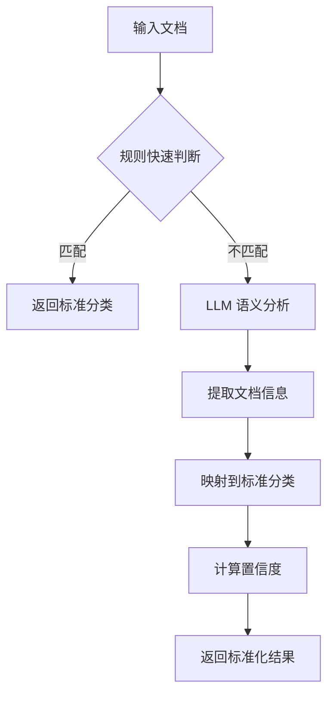

# 法律文档智能分类体系

> **更新日期**: 2026-01-15
> **版本**: v2.0 - 混合分类方法（结构化 + 语义理解）

---

## 📊 分类方法对比

### 优化前（纯 LLM 语义）
```python
# 让 LLM 自由输出文档类型
prompt = """
请提取文档类型（如：函件、通知、合同、协议、回函等）
"""
# 输出：不确定，可能是 "催告函"、"律师函"、"告知函"、"通知书" 等
```

**问题**：
- ❌ 输出不稳定，同一类文档可能有多种表述
- ❌ 无法进行统计分析
- ❌ 前端展示不统一
- ❌ 缺少置信度评估

---

### 优化后（混合分类方法）
```python
# 1. 预定义标准分类体系（枚举）
class DocumentCategory(str, Enum):
    LETTER = "函件"
    LAWYER_LETTER = "律师函"
    DEMAND_LETTER = "催告函"
    # ... 20+ 种标准类型

# 2. LLM 语义理解 + 映射到标准分类
llm_output = "催告函"
standard_category = map_to_standard_category(llm_output)  # DEMAND_LETTER

# 3. 提供置信度评分
confidence = 0.95
```

**优势**：
- ✅ 输出标准化，便于统计和分析
- ✅ 提供置信度，评估可靠性
- ✅ 支持规则辅助判断（快速路径）
- ✅ 可扩展，易于添加新类型

---

## 🏗️ 标准分类体系

### 函件类 (8种)
| 枚举值 | 标签 | 说明 | 示例 |
|--------|------|------|------|
| `LETTER` | 函件 | 通用正式函件 | 联络函、询问函 |
| `LAWYER_LETTER` | 律师函 | 律师代表委托人发送 | XX律师函 |
| `DEMAND_LETTER` | 催告函 | 要求履行义务 | 催款函、催告函 |
| `NOTICE` | 通知 | 通用通知 | XX通知 |
| `SUSPEND_NOTICE` | 停业通知 | 停止营业通知 | 停业通知书 |
| `TERMINATION_NOTICE` | 终止通知 | 终止合同/合作 | 解除通知 |
| `BREACH_NOTICE` | 违约通知 | 告知对方违约 | 违约通知书 |
| `RESPONSE_LETTER` | 回函 | 对函件的回复 | 答复函、回复函 |

### 合同类 (5种)
| 枚举值 | 标签 | 说明 |
|--------|------|------|
| `CONTRACT` | 合同 | 正式合同协议 |
| `SUPPLEMENTARY_AGREEMENT` | 补充协议 | 对主合同的补充 |
| `AMENDMENT_AGREEMENT` | 修订协议 | 修改主合同条款 |
| `MEMORANDUM` | 备忘录 | 会议/协商记录 |
| `LETTER_OF_INTENT` | 意向书 | 合作意向（非约束性）|

### 法律文书 (4种)
| 枚举值 | 标签 | 说明 |
|--------|------|------|
| `COURT_DOCUMENT` | 法院文书 | 判决书、裁定书等 |
| `ARBITRATION_APPLICATION` | 仲裁申请 | 提交仲裁机构 |
| `INDICTMENT` | 起诉状 | 向法院提起诉讼 |
| `DEFENSE` | 答辩状 | 对起诉的答辩 |

### 证据类 (4种)
| 枚举值 | 标签 | 说明 |
|--------|------|------|
| `EVIDENCE` | 证据材料 | 证明事实的材料 |
| `CERTIFICATE` | 证明文件 | 机构出具的证明 |
| `RECEIPT` | 收据 | 收到款项/物品 |
| `INVOICE` | 发票 | 商业发票 |

### 其他
| 枚举值 | 标签 | 说明 |
|--------|------|------|
| `OTHER` | 其他 | 无法归入以上类别 |

---

## 👥 标准角色体系

| 枚举值 | 标签 | 适用场景 |
|--------|------|----------|
| `SENDER` | 发函方 | 来往函件 |
| `RECIPIENT` | 收函方 | 来往函件 |
| `PARTY_A` | 甲方 | 合同关系 |
| `PARTY_B` | 乙方 | 合同关系 |
| `APPLICANT` | 申请人 | 仲裁/申请 |
| `RESPONDENT` | 被申请人 | 仲裁/申请 |
| `PLAINTIFF` | 原告 | 诉讼 |
| `DEFENDANT` | 被告 | 诉讼 |
| `UNKNOWN` | 未知 | 无法识别 |

---

## 🔧 混合分类流程



### 步骤详解

#### 1. 规则快速判断（可选）
```python
# 基于文件名的快速匹配
patterns = {
    DocumentCategory.LAWYER_LETTER: ["律师函", "律所函"],
    DocumentCategory.DEMAND_LETTER: ["催告", "催款"],
    # ...
}

if "律师函" in filename:
    return DocumentCategory.LAWYER_LETTER
```

**优势**：
- ⚡ 速度快，无需调用 LLM
- 💰 成本低
- 🎯 准确率高（明确模式）

#### 2. LLM 语义理解
```python
prompt = f"""
你是专业的法律文档分类助手。

**标准文档分类**:
- 函件: 正式的函件，用于表达意见、要求或通知
- 律师函: 律师代表委托人发送的正式函件
- 催告函: 要求履行义务或支付款项的催告函件
- ... (完整分类列表)

**任务**: 分析文档并选择最准确的分类

请输出 JSON:
{{
  "category": "催告函",
  "confidence": 0.95,
  "reasoning": "文档明确要求对方履行付款义务"
}}
"""
```

**关键设计**：
- 📋 提供完整分类列表供 LLM 选择
- 🎯 要求 LLM 返回标准分类名称
- 📊 要求 LLM 提供置信度和理由

#### 3. 映射到标准枚举
```python
# 允许模糊匹配
category_map = {
    "催告函": DocumentCategory.DEMAND_LETTER,
    "催款函": DocumentCategory.DEMAND_LETTER,  # 别名
    "催付函": DocumentCategory.DEMAND_LETTER,  # 别名
    # ...
}

# 精确或模糊匹配
standard_category = category_map.get(llm_category) or
                   fuzzy_match(llm_category) or
                   DocumentCategory.OTHER
```

#### 4. 置信度评分
```python
confidence = llm_output.get("confidence", 0.8)

# 前端根据置信度显示不同颜色
if confidence >= 0.9: color = "green"
elif confidence >= 0.7: color = "blue"
elif confidence >= 0.5: color = "orange"
else: color = "red"
```

---

## 📝 使用示例

### 输入
```
文件名: 催告函.pdf
内容: "XX公司向YY公司发送催告函，要求支付合同款项..."
```

### 输出
```json
{
  "category": "催告函",
  "confidence": 0.95,
  "reasoning": "文档标题和内容明确表明为催告函，要求支付款项",

  "sender": "XX公司",
  "recipient": "YY公司",
  "sender_role": "发函方",
  "recipient_role": "收函方",

  "date": "2024-01-15",
  "key_dates": ["2024-01-15"],

  "summary": "XX公司向YY公司发送催告函，要求支付合同款项100万元",
  "key_points": [
    "要求支付合同款项",
    "金额为100万元",
    "引用合同第5条约定"
  ]
}
```

### 前端展示
```
┌─────────────────────────────────────────┐
│ #1 催告函.pdf                            │
│ [催告函] [置信度: 95%]                   │
│                                          │
│ 发函方/发件方:  👤 XX公司 [发函方]        │
│ 收函方/收件方:  👤 YY公司 [收函方]        │
│ 文档日期:       📄 2024-01-15             │
│ 分类理由:       文档标题和内容明确表明... │
│                                          │
│ 内容摘要:                                │
│ XX公司向YY公司发送催告函，要求支付...    │
│                                          │
│ 关键要点:                                │
│ • 要求支付合同款项                       │
│ • 金额为100万元                          │
│ • 引用合同第5条约定                      │
└─────────────────────────────────────────┘
```

---

## 🎯 关键改进总结

| 方面 | 优化前 | 优化后 |
|------|--------|--------|
| **分类方式** | 纯 LLM 自由输出 | 结构化枚举 + LLM 映射 |
| **分类稳定性** | ❌ 不稳定（多种表述）| ✅ 标准化（统一枚举）|
| **置信度评估** | ❌ 无 | ✅ 0-1 评分 |
| **规则辅助** | ❌ 无 | ✅ 文件名快速匹配 |
| **可扩展性** | ❌ 需修改 Prompt | ✅ 添加枚举即可 |
| **前端展示** | ❌ 不统一 | ✅ 标准化标签 + 颜色 |
| **统计分析** | ❌ 困难 | ✅ 可直接聚合 |

---

## 🔮 未来扩展方向

### 1. 自学习分类器
```python
# 记录用户修正，逐步优化
user_correction = {
    "llm_output": "告知函",
    "user_selected": "停业通知"
}
# 自动学习映射规则
```

### 2. 多语言支持
```python
CATEGORY_I18N = {
    "zh": {"LETTER": "函件", "LAWYER_LETTER": "律师函"},
    "en": {"LETTER": "Letter", "LAWYER_LETTER": "Lawyer Letter"}
}
```

### 3. 层级分类体系
```python
# 二级分类
LETTER -> [DEMAND_LETTER, RESPONSE_LETTER, ...]
CONTRACT -> [SALES_CONTRACT, SERVICE_CONTRACT, ...]
```

---

**总结**: 新的混合分类方法结合了结构化枚举的稳定性和 LLM 语义理解的灵活性，提供了更好的用户体验和系统可维护性。
